# Dataset Relationship Overview

## Core Graph

```text
ONSPD -> core.postcodes
OS Open USRN -> core.streets_usrn
OS Open Names + ONSPD -> candidates (names_postcode_feature)
OS Open Names + LIDS (TOID->USRN) -> candidates (open_lids_toid_usrn)
OS Open UPRN + NSUL + LIDS (UPRN->USRN) -> candidates (uprn_usrn)
OS Open Roads + core.postcodes -> fallback candidates (spatial_os_open_roads)
Optional: PPD -> gap-fill candidates (ppd_parse_*)
All candidates + weights -> derived.postcode_streets_final
Final + provenance joins -> api projections
```

## Mermaid Diagram

```mermaid
flowchart TB
  subgraph S["Source Datasets"]
    ONSPD["ONSPD"]
    USRN["OS Open USRN"]
    NAMES["OS Open Names"]
    LIDS["OS Open LIDS"]
    UPRN["OS Open UPRN"]
    NSUL["NSUL"]
    ROADS["OS Open Roads"]
    OSNI["OSNI Gazetteer"]
    DFI["DfI Highway"]
    PPD["HM Land Registry PPD"]
  end

  subgraph META["Meta"]
    IR["meta.ingest_run"]
    IRF["meta.ingest_run_file"]
    BB["meta.build_bundle"]
    BBS["meta.build_bundle_source"]
    BR["meta.build_run"]
    BPC["meta.build_pass_checkpoint"]
    CH["meta.canonical_hash"]
    PUB["meta.dataset_publication"]
  end

  subgraph RAW["Raw"]
    R_ONSPD["raw.onspd_row"]
    R_USRN["raw.os_open_usrn_row"]
    R_NAMES["raw.os_open_names_row"]
    R_LIDS["raw.os_open_lids_row"]
    R_UPRN["raw.os_open_uprn_row"]
    R_NSUL["raw.nsul_row"]
    R_ROADS["raw.os_open_roads_row"]
    R_OSNI["raw.osni_gazetteer_row"]
    R_DFI["raw.dfi_highway_row"]
    R_PPD["raw.ppd_row"]
  end

  subgraph STAGE["Stage"]
    S_ONSPD["stage.onspd_postcode"]
    S_USRN["stage.streets_usrn_input"]
    S_NAMES["stage.open_names_road_feature"]
    S_LIDS_PAIR["stage.open_lids_pair"]
    S_LIDS_TOID["stage.open_lids_toid_usrn"]
    S_LIDS_UPRN["stage.open_lids_uprn_usrn"]
    S_UPRN["stage.uprn_point"]
    S_NSUL["stage.nsul_uprn_postcode"]
    S_ROADS["stage.open_roads_segment"]
    S_OSNI["stage.osni_street_point"]
    S_DFI["stage.dfi_road_segment"]
    S_PPD["stage.ppd_parsed_address"]
  end

  subgraph CORE["Core"]
    C_POST["core.postcodes"]
    C_META["core.postcodes_meta"]
    C_STREETS["core.streets_usrn"]
  end

  subgraph DERIVED["Derived"]
    CAND["derived.postcode_street_candidates"]
    LIN["derived.postcode_street_candidate_lineage"]
    FINAL["derived.postcode_streets_final"]
    FINAL_CAND["derived.postcode_streets_final_candidate"]
    FINAL_SRC["derived.postcode_streets_final_source"]
  end

  subgraph INTERNAL["Internal"]
    UNIT["internal.unit_index"]
  end

  subgraph API["API Projections"]
    API_STREET_V["api.postcode_street_lookup__<dataset_version>"]
    API_POST_V["api.postcode_lookup__<dataset_version>"]
    API_STREET["api.postcode_street_lookup (view)"]
    API_POST["api.postcode_lookup (view)"]
  end

  ONSPD --> IR
  USRN --> IR
  NAMES --> IR
  LIDS --> IR
  UPRN --> IR
  NSUL --> IR
  ROADS --> IR
  OSNI --> IR
  DFI --> IR
  PPD --> IR

  IR --> IRF
  IR --> BBS
  BB --> BBS
  BB --> BR
  BR --> BPC
  BR --> CH

  ONSPD --> R_ONSPD
  USRN --> R_USRN
  NAMES --> R_NAMES
  LIDS --> R_LIDS
  UPRN --> R_UPRN
  NSUL --> R_NSUL
  ROADS --> R_ROADS
  OSNI -. optional .-> R_OSNI
  DFI -. optional .-> R_DFI
  PPD -. optional .-> R_PPD

  R_ONSPD --> S_ONSPD
  R_USRN --> S_USRN
  R_NAMES --> S_NAMES
  R_LIDS --> S_LIDS_PAIR
  R_UPRN --> S_UPRN
  R_NSUL --> S_NSUL
  R_ROADS --> S_ROADS
  R_OSNI -. optional .-> S_OSNI
  R_DFI -. optional .-> S_DFI
  R_PPD -. optional .-> S_PPD

  S_LIDS_PAIR --> S_LIDS_TOID
  S_LIDS_PAIR --> S_LIDS_UPRN

  S_ONSPD --> C_POST
  S_ONSPD --> C_META
  S_USRN --> C_STREETS
  S_NAMES --> C_STREETS
  S_LIDS_TOID --> C_STREETS

  C_POST --> CAND
  C_STREETS --> CAND
  S_NAMES --> CAND
  S_LIDS_TOID --> CAND
  S_NSUL --> CAND
  S_LIDS_UPRN --> CAND
  S_ROADS --> CAND
  S_OSNI -. optional .-> CAND
  S_DFI -. optional .-> CAND
  S_PPD -. optional .-> CAND

  S_PPD -. optional .-> UNIT

  CAND --> LIN
  CAND --> FINAL
  C_POST --> FINAL
  C_STREETS --> FINAL

  FINAL --> FINAL_CAND
  CAND --> FINAL_CAND
  FINAL --> FINAL_SRC
  IR --> FINAL_SRC

  FINAL --> API_STREET_V
  FINAL --> API_POST_V
  FINAL_SRC --> API_STREET_V
  FINAL_SRC --> API_POST_V
  BR --> API_STREET_V
  BR --> API_POST_V
  API_STREET_V --> API_STREET
  API_POST_V --> API_POST
  BR --> PUB
```



## Relationship Types
- Validation relationship:
  - ONSPD validates and normalises postcode existence and country/subdivision context.
- Canonical street relationship:
  - USRN is the canonical street key (`core.streets_usrn`).
- Direct semantic relationship:
  - Open Names road features link to postcodes and sometimes TOIDs.
- Identifier bridge relationship:
  - LIDS resolves `TOID -> USRN` and `UPRN -> USRN`.
- Property density relationship:
  - NSUL ties UPRN to postcode, enabling postcode/USRN aggregation with LIDS.
- Spatial fallback relationship:
  - Open Roads provides low-confidence fallback where high-confidence evidence is absent.

## Where Each Relationship Is Materialised
- Raw snapshots: `raw.*`
- Typed normalisation: `stage.*`
- Canonical entities: `core.postcodes`, `core.streets_usrn`
- Evidence graph: `derived.postcode_street_candidates`, `derived.postcode_street_candidate_lineage`
- Final resolved output: `derived.postcode_streets_final`
- Provenance joins: `derived.postcode_streets_final_candidate`, `derived.postcode_streets_final_source`
- API shapes: `api.postcode_street_lookup__<dataset_version>`, `api.postcode_lookup__<dataset_version>`

## Related Docs
- Pass-by-pass detail: [`stages/README.md`](stages/README.md)
- Dataset-specific lineage: [`datasets/README.md`](datasets/README.md)
- Value added by stage: [`value-added-by-stage.md`](value-added-by-stage.md)
- Spec authority: [`../spec/pipeline_v3/spec.md`](../spec/pipeline_v3/spec.md)
